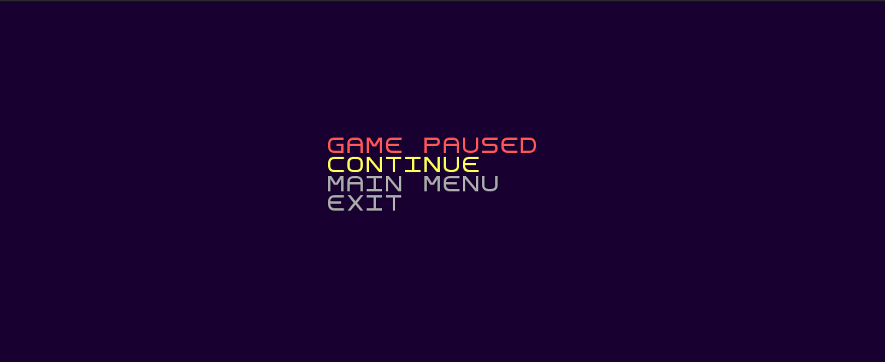

### BERZERK2

	O Agente Anthony é um curioso detetive que pretende descobrir os maiores e mais bem guardados segredos mundo! Para 
    tal, decide infiltrar-se no mais enigmático local do mundo: a Area 51. O que Anthony não sabia era que lhe esperavam
    guardas robots implacavéis, feitos para exterminar qualquer intruso! 
    Neste jogo serás o Agente A. e o teu objetivo é encontrar o caminho de saída de cada uma das salas da Area 51. Mas 
    cuidado! Os robots estão à tua procura, e vão tentar impedir-te de suceder! Podes disparar contra eles para os 
    eliminares, mas eles também estão armados, e dispararão de volta. Além disso, as paredes da sala são feitas de Koli, 
    uma anti-matéria alienígena super secreta que faz com que qualquer entidade da Terra, pessoa ou máquina, se 
    desintegre ao seu toque, por isso mantém-te longe das paredes no teu caminho para a saída!
    Este jogo é inspirado no Berzerk, mas com mais elementos de interação. O Berzerk é um jogo para a Atari 2600 que tem
    como principal objetivo a saída de uma sala repleta de monstros.
	
	Este projeto foi desenvolvido por Duarte Gonçalves (up202108772@up.pt), 
    Gonçalo Miranda (up202108773@up.pt) e Marco Vilas Boas (up202108774@up.pt).

Start Menu

Settings Menu

Pause Menu

Death Menu

Gameplay

Gameplay with Audio
https://user-images.githubusercontent.com/92639552/209405773-07bf3243-824d-4323-8a34-88ed246f14ae.mp4
