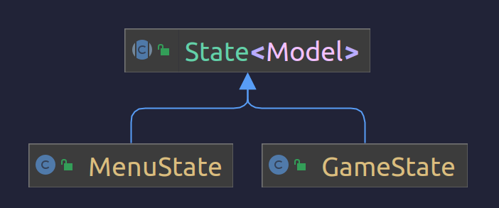
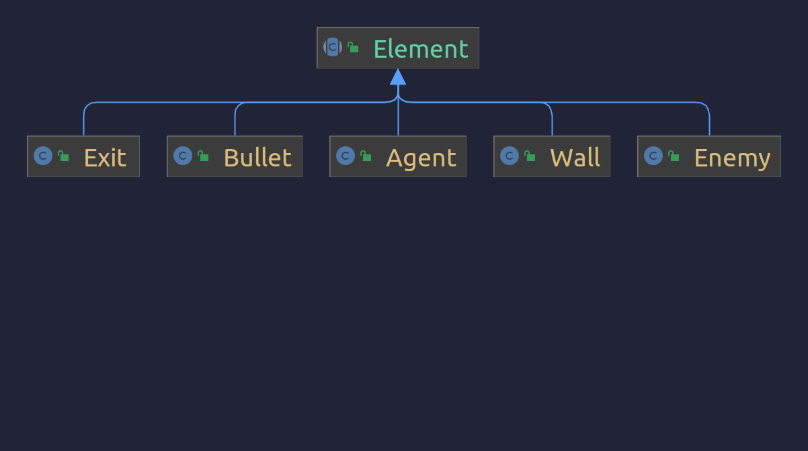
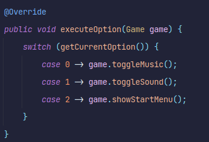

## LDTS_2LEIC01_GR05 - BERZERK2

### Introdução

	O Agente Anthony é um curioso detetive que pretende descobrir os maiores e mais bem guardados segredos mundo! Para tal, decide infiltrar-se no mais enigmático local do mundo: a Area 51. O que Anthony não sabia era que lhe esperavam guardas robots implacavéis, feitos para exterminar qualquer intruso!
	Neste jogo serás o Agente A. e o teu objetivo é encontrar o caminho de saída de cada uma das salas da Area 51. Mas cuidado! Os robots estão à tua procura, e vão tentar impedir-te de suceder! Podes disparar contra eles para os eliminares, mas eles também estão armados, e dispararão de volta. Além disso, as paredes da sala são feitas de Koli, uma anti-matéria alienígena super secreta que faz com que qualquer entidade da Terra, pessoa ou máquina, se desintegre ao seu toque, por isso mantém-te longe das paredes no teu caminho para a saída!
	Este jogo é inspirado no Berzerk, mas com mais elementos de interação. O Berzerk é um jogo para a Atari 2600 que tem como principal objetivo a saída de uma sala repleta de monstros.
	
	Este projeto foi desenvolvido por Duarte Gonçalves (up202108772@up.pt), Gonçalo Miranda (up202108773@up.pt) e Marco Vilas Boas (up202108774@up.pt).

### Funcionalidades implementadas

As seguintes funcionalidades foram implementadas:

- [x] 1.1. Menu inicial: O jogo começa com este menu, que permite iniciar o jogo ou editar as definições.
- [x] 1.2. Menu de definições: Este menu permite alterar as definições de som (para já).
- [x] 2.1. Movimento do jogador: O jogador pode mover-se para cima, baixo, esquerda e direita usando as setas.
- [x] 2.2. Movimento dos robots: Os robots movem-se aleatoriamente, mas não podem mover-se para uma posição que já tenha um robot.
- [x] 2.3. Disparo do jogador: O jogador pode disparar usando a tecla espaço.
- [x] 2.5. Colisão entre o jogador e os robots: Se o jogador colidir com um robot, o jogador perde. No futuro poderá ser implementado um sistema de vidas.
- [x] 2.6. Colisão entre o jogador e as paredes: Se o jogador colidir com uma parede, o jogador perde. No futuro poderá ser implementado um sistema de vidas.
- [x] 2.7. Colisão entre os robots e os disparos do jogador: Se um disparo do jogador colidir com um robot, o robot morre.
- [x] 3.1. "Loading" de um nível: Os níveis são carregados a partir de um ficheiro de texto.
- [x] 4.1. Desenho de Score e Vidas: O score e as vidas são desenhados na parte inferior do ecrã. Para já são apenas pseudo-variáveis, já que o score é sempre escrito como 42 e as vidas são sempre escritas como 3.

### Funcionalidades planeadas
- [ ] 1.3. Menu de pausa: Este menu permite pausar o jogo e voltar ao menu inicial.
- [ ] 1.4. Menu de fim de jogo: Este menu aparece quando o jogador perde, e permite voltar ao menu inicial.
- [ ] 1.5. Menu de estatísticas: Este menu permite ver as estatísticas do jogador.
- [ ] 2.4. Disparo dos robots: Os robots podem disparar, e se o jogador colidir com um disparo, o jogador perde uma vida.
- [ ] 3.2. Sistema de níveis: O jogador passa de nível quando chega à saída.
- [ ] 3.3. Sistema de vidas: O jogador tem um número limitado de vidas, e perde uma vida quando colide com um robot, com uma parede ou com um disparo de robot.
- [ ] 3.4. Sistema de score: O jogador ganha pontos quando mata um robot e quando ganha um nível.

### Design
#### GUI drawing should be different according to the game state
**Problem:** If the game is still in menu, the GUI should "list" the options, but if the game is in playing state, the GUI should show the arena and its elements.

**Pattern:** We used the State pattern to solve this problem. We implemented a State abstract class, and classes MenuState and GameState that implement the update() method accordingly, allowing us to use the same GUI class for both states.

**Implementation:** The following diagram shows the implementation of the State pattern in our project:

**Consequences:** This pattern allows us to have a single GUI class that can be used for both states, and also allows us to easily add new states in the future.

#### All elements behave and are drawn similarly, but have different properties
**Problem:** The agent, the walls, the robots and the bullets are all drawn in the arena and behave similarly, just have different properties, such as ability to move, ability to shoot, etc. We needed a way to represent all of these elements in a single class.

**Pattern:** We used the Factory pattern to solve this problem. We implemented an Element abstract class, and classes Agent, Wall, Enemy and Bullet that extend it. This way we can treat every element in the same way, but also have different properties for each element.

**Implementation:** The following diagram shows the implementation of the Factory pattern in our project:

**Consequences:** This pattern allows us to have a single class that can represent all elements, and also allows us to easily add new elements in the future. This is especially useful for reading the levels from a file, since we can just read the characters and create the corresponding elements.

### Code smells and refactoring opportunities
#### MenuSettings executeOption() method
**Problem:** The executeOption() method in the MenuSettings class is showing the StartMenu when option 2 is chosen.

**Refactoring:** We should create a method to show the previous menu, in case we add a menu between the starting one and the settings one.
