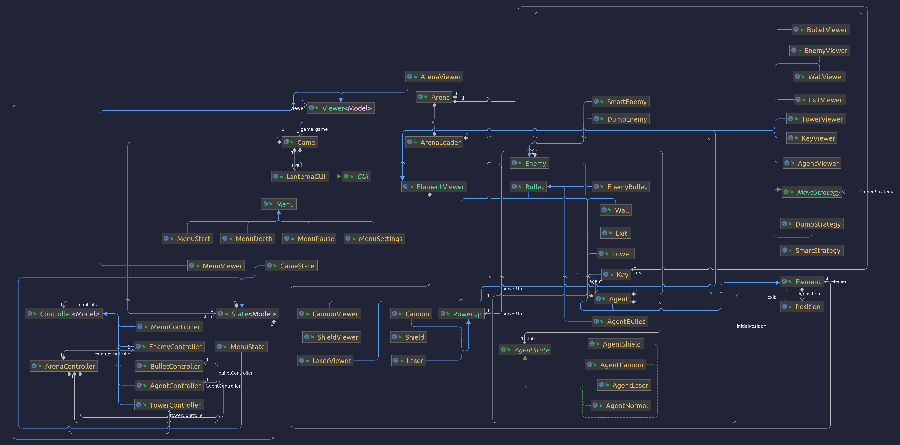

## LDTS_2LEIC01_GR05 - BERZERK2

### Introdução

	O Agente Anthony é um curioso detetive que pretende descobrir os maiores e mais bem guardados segredos mundo! Para 
    tal, decide infiltrar-se no mais enigmático local do mundo: a Area 51. O que Anthony não sabia era que lhe esperavam
    guardas robots implacavéis, feitos para exterminar qualquer intruso! 
    Neste jogo serás o Agente A. e o teu objetivo é encontrar o caminho de saída de cada uma das salas da Area 51. Mas 
    cuidado! Os robots estão à tua procura, e vão tentar impedir-te de suceder! Podes disparar contra eles para os 
    eliminares, mas eles também estão armados, e dispararão de volta. Além disso, as paredes da sala são feitas de Koli, 
    uma anti-matéria alienígena super secreta que faz com que qualquer entidade da Terra, pessoa ou máquina, se 
    desintegre ao seu toque, por isso mantém-te longe das paredes no teu caminho para a saída!
    Este jogo é inspirado no Berzerk, mas com mais elementos de interação. O Berzerk é um jogo para a Atari 2600 que tem como principal objetivo a saída de uma sala repleta de monstros.
	
	Este projeto foi desenvolvido por Duarte Gonçalves (up202108772@up.pt), 
    Gonçalo Miranda (up202108773@up.pt) e Marco Vilas Boas (up202108774@up.pt).

### Funcionalidades implementadas

As seguintes funcionalidades foram implementadas:

- [x] 1.1. Menu inicial: O jogo começa com este menu, que permite iniciar o jogo ou editar as definições.
- [x] 1.2. Menu de definições: Este menu permite alterar as definições de som (para já).
- [x] 1.3. Menu de pausa: Este menu permite pausar o jogo e voltar ao menu inicial.
- [x] 1.4. Menu de fim de jogo: Este menu aparece quando o jogador perde, e permite voltar ao menu inicial.
- [x] 2.1. Movimento do jogador: O jogador pode mover-se para cima, baixo, esquerda e direita usando as setas.
- [x] 2.2. Movimento dos robots: Os robots movem-se aleatoriamente, mas não podem mover-se para uma posição que já tenha um robot.
- [x] 2.3. Disparo do jogador: O jogador pode disparar usando a tecla espaço.
- [x] 2.4. Disparo dos robots: Os robots podem disparar, e se o jogador colidir com um disparo, o jogador perde uma vida.
- [x] 2.5. Colisão entre o jogador e os robots: Se o jogador colidir com um robot, o jogador perde. No futuro poderá ser implementado um sistema de vidas.
- [x] 2.6. Colisão entre o jogador e as paredes: Se o jogador colidir com uma parede, o jogador perde. No futuro poderá ser implementado um sistema de vidas.
- [x] 2.7. Colisão entre os robots e os disparos do jogador: Se um disparo do jogador colidir com um robot, o robot morre.
- [x] 3.1. "Loading" de um nível: Os níveis são carregados a partir de um ficheiro de texto.
- [x] 3.2. Sistema de níveis: O jogador passa de nível quando chega à saída.
- [x] 3.3. Sistema de vidas: O jogador tem um número limitado de vidas, e perde uma vida quando colide com um robot, com uma parede ou com um disparo de robot.
- [x] 3.4. Sistema de score: O jogador ganha pontos quando mata um robot e quando ganha um nível.
- [x] 4.1. Desenho de Score e Vidas: O score e as vidas são desenhados na parte inferior do ecrã. Para já são apenas pseudo-variáveis, já que o score é sempre escrito como 42 e as vidas são sempre escritas como 3.

### Funcionalidades planeadas, mas não implementadas
- [ ] 1.5. Menu de estatísticas: Este menu permite ver as estatísticas do jogador.

### Diagrama UML
Neste diagrama UML, podemos ver as classes que foram implementadas e como se relacionam entre si.

### Design
#### A GUI deve 'desenhar' de forma diferente conforme o estado do jogo
**Problema:** Se o jogo está em estado de menu, a GUI deve desenhar o menu. Se o jogo está em estado de jogo, a GUI deve desenhar a arena e os respetivos elementos, o score e as vidas.

**Pattern:** Para resolver este problema usamos o pattern State. Implementamos uma abstract class State, e as classes MenuState e GameState, que implementam o método update() de forma diferente. O método update() é chamado a cada frame, e é responsável por desenhar o estado atual do jogo.

**Implementação:** O seguinte diagrama mostra a implementação do pattern State no nosso projeto:

**Consequências:** Este pattern permite-nos desenhar a GUI de forma diferente consoante o estado do jogo, e permite-nos adicionar mais estados ao jogo sem ter de alterar a GUI.

#### O agente deve comportar-se de formas diferentes conforme o power-up que carrega.
**Problema:** Se o agente possuir um shield, deverá ser invulnerável ao primeiro ataque de monstro que receber, se possuir um canon deve disparar uma bala em cada direção (apenas uma vez) e se possuir um lazer dispara um "feixe" de balas na direção para a qual aponta, até à parede mais próxima.

**Pattern:** Para resolver este problema usamos o pattern State. Implementamos uma abstract class AgentState, e as classes AgentCannon, AgentLaser, AgentNormal and AgentShield, que implementam o método shoot() de forma diferente. O método shoot é responsável por fazer o agente disparar e é chamado a cada vez que o utilizador pressiona a tecla designada para essa ação (tecla de espaço - Spacebar).

**Implementação:** O seguinte diagrama mostra a implementação do pattern State no nosso projeto:

**Consequências:** Este pattern permite-nos implementaros disparos do agente de diferente consoante o power-up utilizado, e permite-nos adicionar mais power-ups ao jogo sem ter de alterar o agente.

#### Todos os elementos se comportam de forma semelhante, mas com propriedades diferentes
**Problema:** O agente, as paredes, os robots e os disparos são todos parte da arena e comportam-se de forma semelhante, mas têm propriedades diferentes, como o movimento e a abilidade de disparar. Precisavamos de uma maneira de representar todos estes elementos de forma a que fosse fácil adicionar novos elementos ao jogo.

**Pattern:** Usamos o pattern Factory Method. Implementamos uma abstract class Element, e as classes Agent, Wall, Robot e Shot, que a implementam. Assim conseguimos tratar tudo como se de um Element se tratasse, e adicionar novos elementos ao jogo sem ter de alterar o código.

**Implementação:** O seguinte diagrama mostra a implementação do pattern Factory Method no nosso projeto:

**Consequências:** Este pattern permite-nos tratar todos os elementos como se de um Element se tratasse, e adicionar novos elementos ao jogo sem ter de alterar o código.

### 'Code smells' e oportunidades de 'refactoring'
#### MenuSettings executeOption()
**Problema:** O método executeOption() da classe MenuSettings está programado para mostrar o menu inicial 
quando se escolhe a opção "Back", assumindo que este menu é sempre chamado a partir do menu inicial.

**Refactoring:** Devemos criar um método que mostre o menu anterior, e chamar esse método quando se escolhe a opção "Back".

#### DrawMenu é demasiado longo
**Problema:** O método drawMenu() na classe LanternaGUI é demasiado longo.

**Refactoring:** Deviamos dividir este metodo em dois, drawTitle() e drawOptions(), para tornar o código mais legível.

### Testing
#### Testes de unidade
Todos os testes realizados passam, mas ainda falta implementar alguns testes.

### Testes de mutação
Foi atingida uma Mutation Coverage de 66%, se presentes na avaliação as classes Game e LanternaGUI.

Posteriormente, se não contarmos com essas classes, a coverage aumenta para 67%.

### Auto-avaliação
Gonçalo: 33%
Duarte: 33%
Marco: 33%
